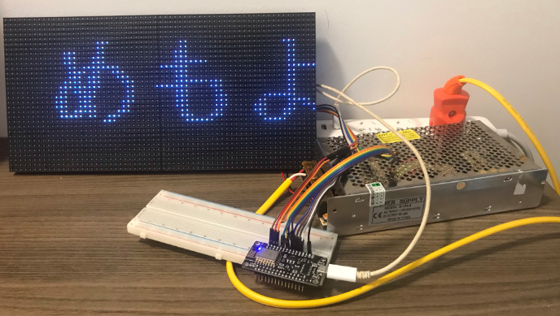

# Control a LED matrix with ESP8266

## Introduction

In Vietnam, advertisement banners using LED matrix modules are very popular. Just tell a vendor the size you want, the resolution you want, and you will get a beautiful, bright and dynamic banner over your commerce, a catch-eye for any person walking by.


Then you will have complet control over the content of your banner. The vendor you give you a compatible software to install into your computer, or an app to download from Google Play or iOS... so that you can design and "push" your own content to the banner.

Complet control? Not really so. Those app, although the user interface is in Vietnamese, are all Chinese-like and Windows-compatible only (if not mobile app). Upload content to the banner is a PROCESS that takes time. The only way to interact with YOUR banner is through PROPRIETARY software, which you have no control on how they function.

That's why I try to make these awesome LED matrix modules really interactive, which responds immediately to users' actions, eg. display text according the button pushed by kids in our Science Centre.

### Materials

Main equipments:

* LED Matrix full color: "P5(2121)-16S-6432-BO" ie. type P5, resolution 64x32, scan rate 1/16
* ESP8266 Module (12E) (product of LoLin)

Accessories:

* Power source: 5A 20A (more than enough)
* and other thing (cf. assembing sections)

> Why an ESP8266 board? Because in our Science Centre we want kids to look at big display, which means at least a 64x32 P5 LED module. With that high resolution, the classic Arduino Uno, that everyone can think of in the first place, will run out of memory. So the next cheap board is ESP8266, and then Arduino Mega, then Raspberry Pi.

## Current state of development and TODOs

Now I could:

* Get the right wiring and configuration code to control a 64x32 P5 LED module with an ESP8266 board;
* Display correctly an English (scrolled) sentence on it.
* Customize ascii font



PROBLEMS:

* Vietnamese not correctly displayed;
* It seems that the ESP8266 has not many GPIO pins left for further application;
* Messy cable management;
* 1 module is too short to display a long sentence. I am reluctant to chain the 2nd module under the same software, because people got problems of color and line alignment when they do so with the current PxMatrix library. 

TODOs:

* Try to display Vietnamese text with the right font (Japanese hiragana passes more or less, [example here](https://github.com/adafruit/Adafruit-GFX-Library/pull/200));

* Do proper cable management:

  * 30cm female-female dupont x5;
  * 50cm femail-male dupont x11;
  * Power cables for module
  * DC mail-female jacks with domino
  * 2 and 3-way 8x2 cables

* Figure out how to chain the 2nd module:

  * Ask people on PxMatrix GitHub issue page
  * Buy 8x2 holes cables;
  * Solder 2 more 8x2 sockets on the module; 

* Control the LED module with Arduino MEGA (more pins to use);
* Control the LED module with Raspberry Pi (more pins to use, but more expensive and other complications (voltage...)): [here](https://github.com/hzeller/rpi-rgb-led-matrix/);
* or with an ESP32 and [this library](https://github.com/mrfaptastic/ESP32-RGB64x32MatrixPanel-I2S-DMA).

## How-to

This sections help overcome step-by-step the difficulties one might get (and I got) when dealing this project.

### Test ESP8266 only

I want to set up the Arduino environment for ESP8266 and verify that my ESP8266 functions correctly.

I followed this [Random Nerd tutorial](https://randomnerdtutorials.com/esp8266-web-server/) and everything just worked.

### Configure the LED module with ESP8266

There are not so many ways to work with these Chinese, no-brand LED matrix modules. I use [PxMatrix](https://github.com/2dom/PxMatrix/), which is based on Adafruit GFX library. So the big view is: you follow the PxMatrix documentation to turn the LED module on, but you follow Adafruit GFX Library to draw on it.

But even with the documentation of PxMatrix, it took me a lot of trials and errors to get this work.

#### Wiring

```
            PI
        -----------
D7  ←   R1      G1   →  R2
G2  ←   B1      GND
R1  ←   R2      G2   →  G1
B1  ←   B2      GND  →  GND
D1  ←   A       B    →  D2
D8  ←   C       D    →  D6
D5  ←   CLK     LAT  →  D0
D4  ←   OE      GND  →  GND
```

#### Install libraries

In Arduino IDE's library manager, look for and install:

* PxMatrix
* Adafruit GFX Library

#### Config code

The following are must-have code lines in any sketche, that other tutorials give you the choices, but I have figured out which ones are optional, which ones are mandatory for my LED module.

```
# outside any function 
PxMATRIX display(64, 32, P_LAT, P_OE, P_A, P_B, P_C, P_D);
```

```
# in display_update_enable
# 0.04 will make the display blink
display_ticker.attach(0.004, display_updater);
```

```
# in setup()
# the scan rate of the LED module is 1/16
display.begin(16);
```

```
# in setup()
# if this instruction is absent, there will missing lines on the display
display.setMuxDelay(1,1,1,1,1);
```

I stick with `Serial.begin(9600)` for baud rate and let `setup()` the time (`delay(3000)`) without forcing the card to do anything at this stage.

### Load custom font

Follow [this guide](https://learn.adafruit.com/adafruit-gfx-graphics-library/using-fonts).

Pay attention to the cursor position. With custom font, the cursor will be at the bottom left corner of the letter, not at top-left anymore.