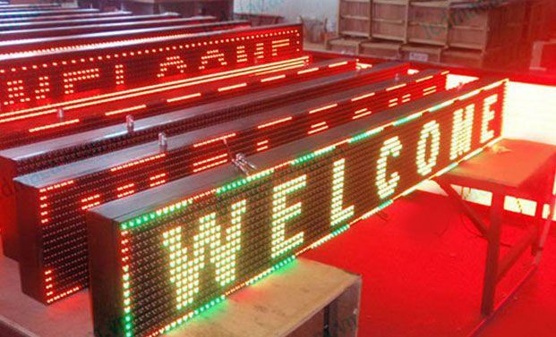
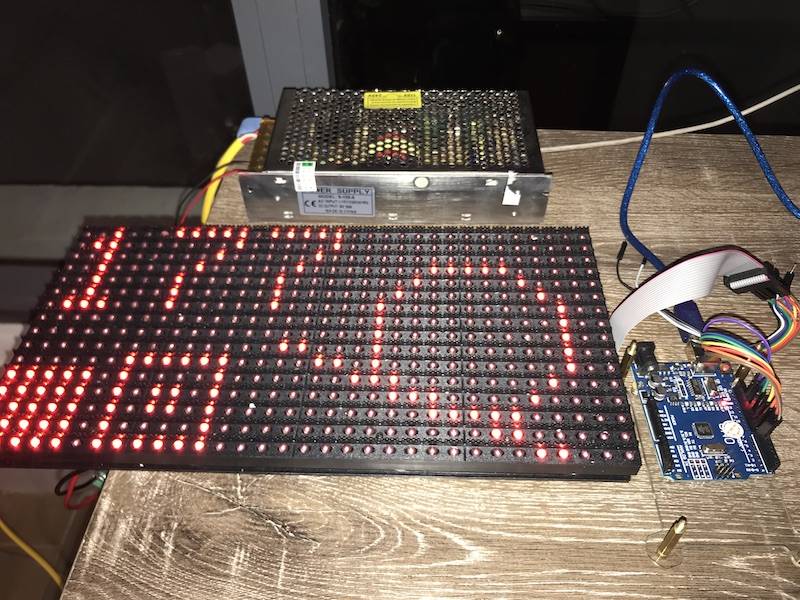
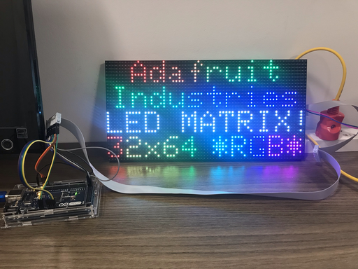

# Control LED matrix modules with open-source platforms

## Overview

In Vietnam, advertisement banners using LED matrix modules are very popular. Just tell a vendor the size you want, the resolution you want, and you will get a beautiful, bright and dynamic banner over your commerce, a catch-eye for any person walking by.



Then you will have complet control over the content of your banner. The vendor you give you a compatible software to install into your computer, or an app to download from Google Play or iOS... so that you can design and "push" your own content to the banner.

Complet control? Not really so. Those app, although the user interface is in Vietnamese, are all Chinese-like and Windows-compatible only (if not mobile app). Upload content to the banner is a process that takes time. The only way to interact with commercial banners is through proprietary softwares, which offer no other, physical input methods (like buttons...).

That's why I try to make these awesome LED matrix modules really interactive, which responds immediately to users' actions, eg. display text according a kid's action in our Science Centre.

For that purpose, I propose to myself to test common LED matrix modules with common open-source microcontroller. At the end, people going through this guide will know how to make correct wiring, know which libraries to use and run an example sketch.

## Roadmap

* Display Vietnamese
* Chain modules
* Control the LED module with Raspberry Pi (more pins to use, but more expensive and other complications (voltage...)): [here](https://github.com/hzeller/rpi-rgb-led-matrix/);
* or with an ESP32 and [this library](https://github.com/mrfaptastic/ESP32-RGB64x32MatrixPanel-I2S-DMA).

## Control P10 32x16 Red with Arduino Uno



Materials:

* LED matrix module of type P10, connectors of type HUB12. There is "P10(1R)-806-A" and DIP-DP4536" written on the back of the module.
* Arduino Uno 

Accessories:

* Power source: 5A 20A (more than enough) and power cables
* IDC 2x8 ribbon cable (optional)
* 7 male-male dupont cables

Wiring:

```
          port in
        -----------
D9  ←   OE        A   →  D6
GND ←   N         B   →  D7
        N         C
        N         S   →  D13
        N         L   →  D8
        N         R   →  D11
        N         G
        N         D
```

Source: See [this guide](https://youtu.be/z5G-HO3mFV0) at 1:36 for wiring

Libraries:

* Install DMD2 from Arduino IDE's Library Manager

### TODOs

Make a connector PCB like this [DMDCon](https://cdn.shopify.com/s/files/1/0045/8932/products/DMDCON-1_1024x1024.jpg?v=1489536771) (its drawing can be found [here](https://cdn.shopify.com/s/files/1/0045/8932/products/DMDCON-1_1024x1024.jpg?v=1489536771)).

But we will do it simpler: same wiring as above, the only modification for safety is that all N will go to GND. We will forget completely C, D and G.

## Control P5 fullcolor 64x32 with ESP8266

The avantage of an ESP8266 board is that it is controllable via Internet, and those boards are cheaper than other alternatives (3x cheaper than an Arduino Mega).

Material and libraries:

* ESP8266 Module (12E) (product of LoLin)
* PxMatrix 1.8.1 by Dominic Buchstaller
* Adafruit GFX Library 1.10.2 (and the prerequisite Adafruit BusIO)

There are not so many ways to work with these Chinese, no-brand LED matrix modules. I use [PxMatrix](https://github.com/2dom/PxMatrix/), which is based on Adafruit GFX library. So the big view is: you follow the PxMatrix documentation to drive the module, but you follow Adafruit GFX Library to draw on it. However, as you will see (cf. the how-to section), the PxMatrix documentation is not enough to make the module work properly.

### Current state of development and TODO list

Now I could:

* Get the right wiring and configuration code to control a 64x32 P5 LED module with an ESP8266 board;
* Display correctly an English (scrolled) sentence on it.
* Change (non-unicode) text fonts


PROBLEMS:

* Vietnamese not correctly displayed;
* It seems that the ESP8266 has not many GPIO pins left for other inputs (like buttons);
* Messy cable management (maybe inherent to the library, cause one has to connect PI and PO);
* Can be troublesome to chain the 2nd module, because people got problems of color and line alignment when they do so with the current PxMatrix library.

TODOs:

* Try to display Vietnamese text with the right font;
* Figure out how to chain the 2nd module (Ask people on PxMatrix GitHub issue page)

### How-to

This sections help overcome step-by-step the difficulties one might get (and I got) when dealing with this board.

#### Hardware test

To set up the Arduino environment for ESP8266 and verify that my ESP8266 functions correctly, I followed this [Random Nerd tutorial](https://randomnerdtutorials.com/esp8266-web-server/) and everything just worked.

#### Hardware setup

The proper way to wire ESP8266 and the LED module is the following (cf. also the PxMatrix documentation, but it turned out that they insisted not enough on ground connection):

```
            PI
        -----------
D7  ←   R1      G1   →  R2
G2  ←   B1      GND
R1  ←   R2      G2   →  G1
B1  ←   B2      GND  →  GND
D1  ←   A       B    →  D2
D8  ←   C       D    →  D6
D5  ←   CLK     LAT  →  D0
D4  ←   OE      GND  →  GND
```

#### Software setup

The following lines are fine-tuned for my LED module:

In the top part of the sketch:

```
PxMATRIX display(64, 32, P_LAT, P_OE, P_A, P_B, P_C, P_D);
```

In display_update_enable() (cf. pixeltime example)

```
# 0.04 will make the display blink
display_ticker.attach(0.004, display_updater);
```

In setup():

```
# the scan rate of the LED module is 1/16
display.begin(16);

# to avoid missing lines
display.setMuxDelay(1,1,1,1,1);
```

Finally, I stick with `Serial.begin(9600)` for baud rate and let `setup()` the time (`delay(3000)`) without forcing the card to do anything at this stage.

#### Load custom font

Follow [this guide](https://learn.adafruit.com/adafruit-gfx-graphics-library/using-fonts).

Pay attention to the cursor position. With custom font, the cursor will be at the bottom left corner of the letter, not at top-left anymore.

## Control with an Arduino Mega

Among the Arduino family, Arduino Mega is a must to control these 64x32 LED modules, because the "classic" Arduino Uno has not enough memory.

My main reference is [this tutorial](https://www.instructables.com/64x32-RGB-LED-Matrix-With-Arduino-Mega/). But this is not enough. See how-to section for more.

Material and libraries:

* Arduino Mega 2560 (with ATMega16U2 chip)
* RGB matrix Panel 1.1.5 by Adafruit
* Adafruit GFX Library 1.10.2 (and the prerequisite Adafruit BusIO). Main methods [here](https://learn.adafruit.com/adafruit-gfx-graphics-library/graphics-primitives).

### Current state of development and TODO list

I found that the wiring with an Arduino Mega is much more proper than with an ESP8266. The sketch upload is also easier: with an ESP8266, I had to unplug everything to upload a sketch, then re-plug everything to test, otherwise the upload failed easily. It may be due to the CH340 chip used on my ESP board.

Now I could:

* Run the example sketch for a 64x32 module
* Display a bitmap image (first step toward Vietnamese characters)



TODOs:

* Proper wiring: make a shield to make connection easier (objective: no more dupont cables).
* Display Vietnamese:

  * Try [this tutorial](http://iot47.com/matrix-ledbai-13-thiet-ke-bo-font-tieng-viet/)
  * See [this video](https://www.youtube.com/watch?v=upurbYGPvKo)
  * Try https://anyconv.com/vi/chuyen-doi-ttf-sang-bmp/
  * Try [this forked library](https://github.com/Bodmer/Adafruit-GFX-Library) by Bodmer.
  * Try https://taimienphi.vn/download-alphabix-19984

  
### How-to

This sections help overcome step-by-step the difficulties one might get (and I got) when dealing with this board.

#### Software setup

The following lines are fine-tuned for my LED module:

```
#define CLK 11
RGBmatrixPanel matrix(A, B, C, D, CLK, LAT, OE, false, 64);
```

#### Display a bitmap image

For example, to display a 32x32 image of letter A on the module, I did the following:

* Download the 32x32 png image from [this site](https://www.iconsdb.com/custom-color/letter-a-icon.html)
* Rename the file to `letter_a_32.png`
* Convert the last image to .c using [this online tool](http://www.rinkydinkelectronics.com/t_imageconverter565.php)
* Rename the extension of .c file to .h
* Use the image in the code:

```
#include "letter_a_32.h"
matrix.drawRGBBitmap(0,0,(const uint16_t *)letter_a_32,32,32);
```

