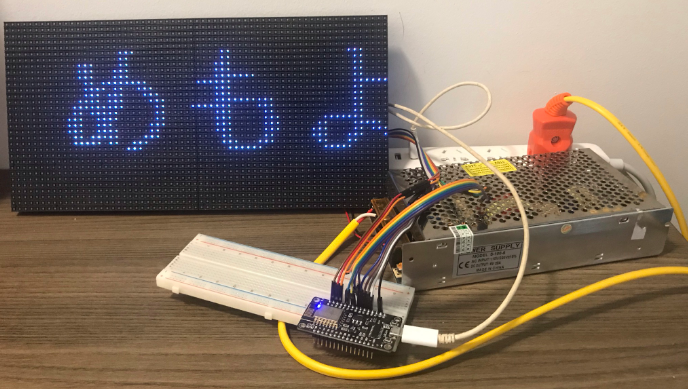

# Control P5 64x32 RGB with ESP8266

The avantage of an ESP8266 board is that it is controllable via Internet, and those boards are cheaper than other alternatives (3x cheaper than an Arduino Mega).



## Pre-requisites

Material:

* LED Matrix RGB: "P5(2121)-16S-6432-BO" ie. type P5, resolution 64x32, scan rate 1/16 (and HUB 75);
* ESP8266 Module (12E) (product of LoLin).

Accessories:

* Power source: 5A 20A (more than enough) and power cables;
* IDC 2x8 ribbon cable + 15 male-male dupont cables (optional) OR 15 female-male dupont cables.

Wiring:

```
            PI
        -----------
D7  ←   R1      G1   →  R2
G2  ←   B1      GND
R1  ←   R2      G2   →  G1
B1  ←   B2      GND  →  GND
D1  ←   A       B    →  D2
D8  ←   C       D    →  D6
D5  ←   CLK     LAT  →  D0
D4  ←   OE      GND  →  GND
```

> I had to unplug everything each time I wanted to upload a sketch, otherwise the upload would easily fail. It may be due to the cheap CH340 chip used on my ESP board.

Librairies:

* PxMatrix 1.8.1 by Dominic Buchstaller
* Adafruit GFX Library 1.10.2 (and the prerequisite Adafruit BusIO)

> There are not so many ways to work with these Chinese, no-brand LED matrix modules. I use [PxMatrix](https://github.com/2dom/PxMatrix/), which is based on Adafruit GFX library. So the big view is: you follow the PxMatrix documentation to drive the module, but you follow Adafruit GFX Library to draw on it. However, as you will see (cf. the how-to section), the PxMatrix documentation is not enough to make the module work properly.

## Code setup

The following lines are fine-tuned for my LED module:

In the top part of the sketch:

```
PxMATRIX display(64, 32, P_LAT, P_OE, P_A, P_B, P_C, P_D);
```

In display_update_enable() (cf. pixeltime example)

```
# 0.04 will make the display blink
display_ticker.attach(0.004, display_updater);
```

In setup():

```
# the scan rate of the LED module is 1/16
display.begin(16);

# to avoid missing lines
display.setMuxDelay(1,1,1,1,1);
```

Finally, I stick with `Serial.begin(9600)` for baud rate and let `setup()` the time (`delay(3000)`) without forcing the card to do anything at this stage.

## How-to

This sections help overcome step-by-step the difficulties one might get (and I got) when dealing with this board.

### Load custom font

Follow [this guide](https://learn.adafruit.com/adafruit-gfx-graphics-library/using-fonts).

Pay attention to the cursor position. With custom font, the cursor will be at the bottom left corner of the letter, not at top-left anymore.

## Remarks

On PxMatrix GitHub issue page, people got problem when they daisy-chain a 2nd module (wiring how?): there will be color and line aberration on the 2nd one.

Other intrinsic problems:

* ESP8266 has not many GPIO pins left for other inputs (like buttons);
* Messy cable management (maybe inherent to the library, because we have to connect PI and PO);

## References

To set up the Arduino environment for ESP8266 and verify that my ESP8266 functions correctly, I followed this [Random Nerd tutorial](https://randomnerdtutorials.com/esp8266-web-server/) and everything just worked.
