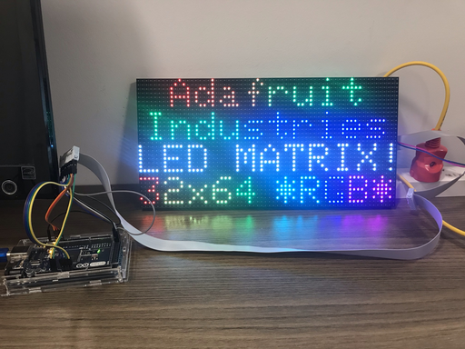

# Control P5 64x32 RGB with Arduino Mega

Among the Arduino family, Arduino Mega is a must to control these 64x32 fullcolor modules, because the "classic" Arduino Uno has not enough memory.



## Pre-requisites

Material:

* LED Matrix RGB: "P5(2121)-16S-6432-BO" ie. type P5, resolution 64x32, scan rate 1/16 (and HUB 75);
* Arduino Mega 2560 (with ATMega16U2 chip).

Accessories:

* Power source: 5A 20A (more than enough) and power cables;
* IDC 2x8 ribbon cable + 16 male-male dupont cables (optional) OR 16 female-male dupont cables.

Wiring:

* Follow this [image](https://content.instructables.com/ORIG/F0T/A1J1/KB3NI32G/F0TA1J1KB3NI32G.jpg?auto=webp&frame=1&width=1024&fit=bounds&md=724fc8315b32ecb907864519055302ff).

> I found that the wiring with an Arduino Mega is much more proper than with an ESP8266. The Mega seems to be more stable: we can upload and play a new sketch on the live while Mega is still plugged into the computer.

Libraries:

* RGB matrix Panel 1.1.5 by Adafruit
* Adafruit GFX Library 1.10.2 (and the prerequisite Adafruit BusIO).

> The main functions of this GFX Library are [here](https://learn.adafruit.com/adafruit-gfx-graphics-library/graphics-primitives).

## Code setup

The following lines are fine-tuned for my LED module:

```
#define CLK 11
RGBmatrixPanel matrix(A, B, C, D, CLK, LAT, OE, false, 64);
```

## How-to

### Display a bitmap image

I could display a bitmap image - it's the first step toward Vietnamese characters.

For example, to display a 32x32 image of letter A on the module, I did the following:

* Download the 32x32 png image from [this site](https://www.iconsdb.com/custom-color/letter-a-icon.html)
* Rename the file to `letter_a_32.png`
* Convert the last image to .c using [this online tool](http://www.rinkydinkelectronics.com/t_imageconverter565.php)
* Rename the extension of .c file to .h
* Use the image in the code:

```
#include "letter_a_32.h"
matrix.drawRGBBitmap(0,0,(const uint16_t *)letter_a_32,32,32);
```

## TODO list

Now we will need:

* A proper wiring: make a shield to make connection easier (objective: no more dupont cables).
* Find a way to display Vietnamese:

  * Try [this tutorial](http://iot47.com/matrix-ledbai-13-thiet-ke-bo-font-tieng-viet/)
  * See [this video](https://www.youtube.com/watch?v=upurbYGPvKo)
  * Try https://anyconv.com/vi/chuyen-doi-ttf-sang-bmp/
  * Try [this forked library](https://github.com/Bodmer/Adafruit-GFX-Library) by Bodmer.
  * Try https://taimienphi.vn/download-alphabix-19984

## References

My main reference is [this tutorial](https://www.instructables.com/64x32-RGB-LED-Matrix-With-Arduino-Mega/).
