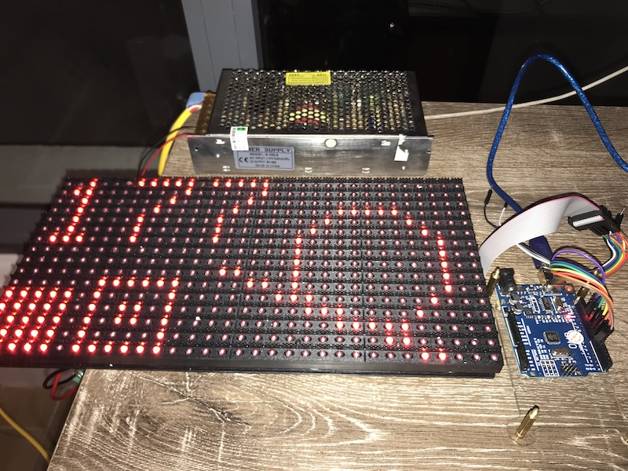

# Control P10 32x16 Red with Arduino Uno



Materials:

* LED matrix module of type P10, connectors of type HUB12. There is "P10(1R)-806-A" and DIP-DP4536" written on the back of the module.
* Arduino Uno

Accessories:

* Power source: 5A 20A (more than enough) and power cables
* IDC 2x8 ribbon cable (optional)
* 7 male-male dupont cables

Wiring:

```
          port in
        -----------
D9  ←   OE        A   →  D6
GND ←   N         B   →  D7
        N         C
        N         S   →  D13
        N         L   →  D8
        N         R   →  D11
        N         G
        N         D
```

> Source: See [this guide](https://youtu.be/z5G-HO3mFV0) at 1:36 for wiring

Libraries:

* Install DMD2 from Arduino IDE's Library Manager

### TODOs

Make a connector PCB like this [DMDCon](https://cdn.shopify.com/s/files/1/0045/8932/products/DMDCON-1_1024x1024.jpg?v=1489536771) (its drawing can be found [here](https://cdn.shopify.com/s/files/1/0045/8932/files/DMDCON_DMDConnector.pdf?100730)).

But we will do it simpler: same wiring as above, the only modification for safety is that all N will go to GND. We will forget completely C, D and G.
